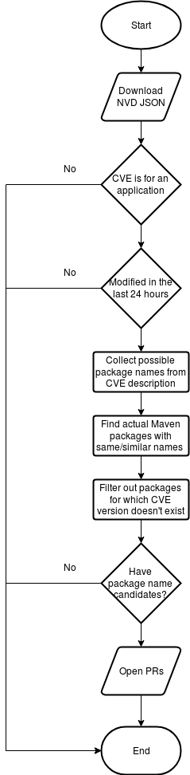

# fabric8-analytics CVEjob

This document describes the current "naive" CVE job which we run in CI once a day.

The job is pretty straightforward. See the simplified flowchart diagram:




The steps described in more details:

### Downloading NVD JSON

We download ["CVE-Recent"](https://static.nvd.nist.gov/feeds/json/cve/1.0/nvdcve-1.0-recent.json.gz) JSON feed from [NIST](https://nvd.nist.gov/vuln/data-feeds#JSON_FEED).
We do this daily. The feed contains vulnerabilities that were published or modified in past eight days.

With this data feed, we will capture both brand new CVEs and older CVEs that were recently updated.

### Application CVEs and modification date

We run the CVE job once a day so we filter out vulnerabilities that were not modified (or published) in the past 24 hours.
NVD covers vulnerabilities for applications, operating systems and hardware components. We only care about applications/libraries,
we ignore vulnerable microwaves (for now!:)).

### Collecting possible package names from CVE description

Product part of a CPE identifier is sometimes similar to the actual package name as we know it. But there are
some problems with it:

* single CPE product can represent multiple packages (1:N mapping)
* sometimes the product name is vastly different from the actual package name
  * for example: (CPE product) `jboss_wildfly_application_server` -> (package name) `io.undertow:undertow-core`

In many cases, description can help us to reveal what the actual package name is. The description often starts with something like:

```text
Previous versions of Apache Flex BlazeDS (4.7.2 and earlier) did not restrict which types were allowed ...
```

Or:

```text
The Apache DeltaSpike-JSF 1.8.0 module has a XSS injection leak in the windowId handling. The default size of the windowId get's cut off after 10 characters ...
```

I.e. very first sentence of the description often hints what the package name could be. We take this into account and currently use following, a bit naive, approach:

* we take the first sentence from CVE description
* we find all words which are starting with capital letters and consider such words to be possible package names

This can be improved significantly, but even the current approach produces surprisingly good results.

 
### Finding actual Maven packages

With the product:vendor pair extracted from the CPE, and a list of possible package (product)
names extracted from the description, we can attempt to find actual Maven packages.

We use a tool called [cpe2pkg](https://github.com/msrb/cpe2pkg) which builds lucene index out of all packages
that are available in Maven Central. We then query the index with vendor:product strings that we identified in the previous step.

The tool returns top 10 matches with confidence score.


It is important to note here that we only focus on Maven at the moment. It is possible that once we start supporting more ecosystem,
number of false positives will increase significantly (see [issue#2005](https://github.com/openshiftio/openshift.io/issues/2005)).


### Filtering out false positives

Records in NVD often also contain information on which version of given product is affected. We use this information to filter out packages identified in the previous step
for which given version doesn't exist.
The assumption here is that if CVE record says that all versions before XYZ are vulnerable,
then the version XYZ must exists for given package. If it doesn't, we consider such package name to be false positive.


### Opening Pull Requests

If we have at least one package name candidate, we open a PR in [fabric8-analytics/cvedb](https://github.com/fabric8-analytics/cvedb/) and let humans to verify the result.


# TODOs

There is room for improvement on every level of the pipeline. We need to try things and see what works and what doesn't.

* currently we are not even trying to identify versions/version ranges that are affected by vulnerabilities.
Automating this should be possible to some degree (see [issue#2006](https://github.com/openshiftio/openshift.io/issues/2006)).
There are [plans](https://nvd.nist.gov/General/News/CPE-Range-Notification) to include version ranges directly in NVD,
but this will likely apply only for newly added CVEs.

* we don't know how to map CVEs to ecosystems. This can become a huge problem once we start supporting more than one ecosystem.

* currently there is no way how to measure whether we are getting better or worse.
